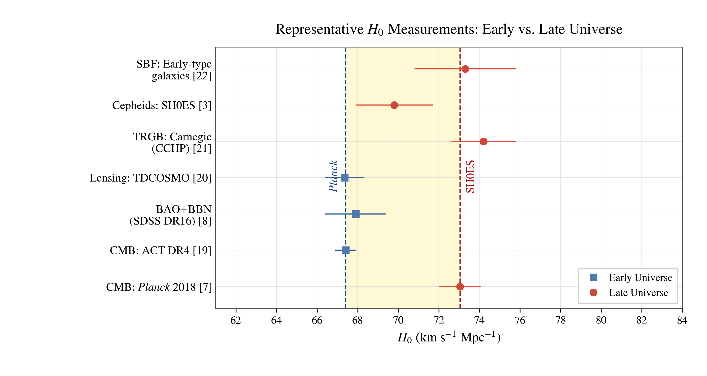
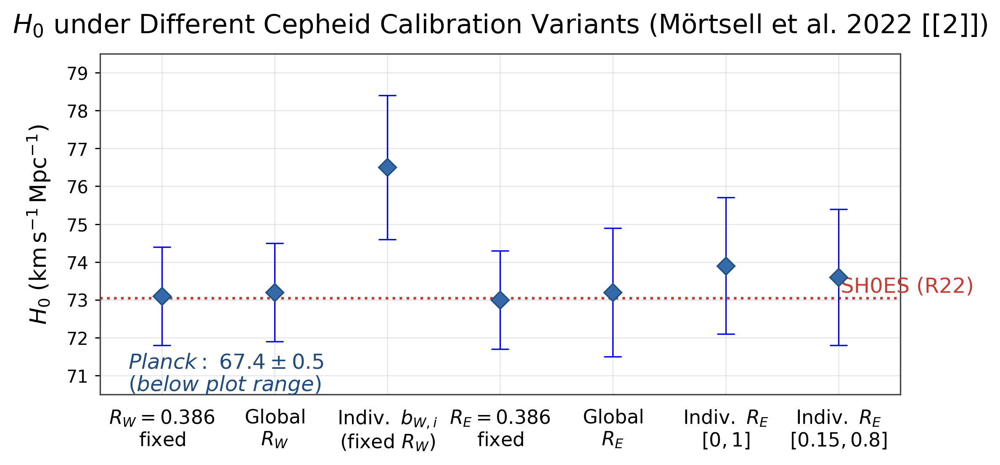
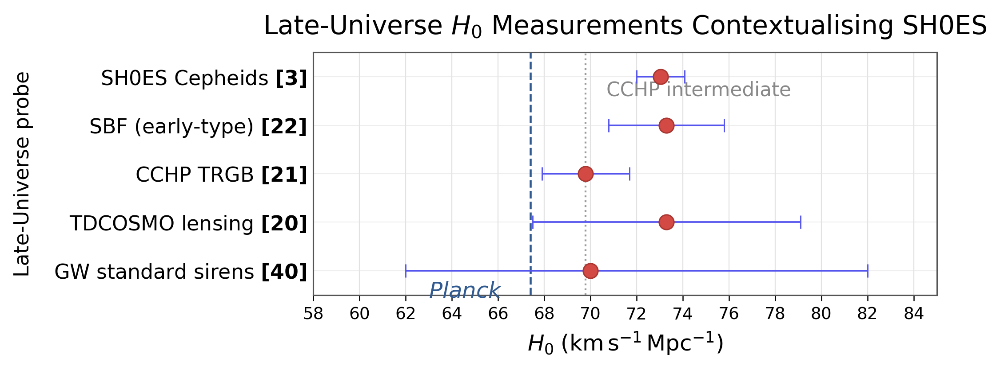
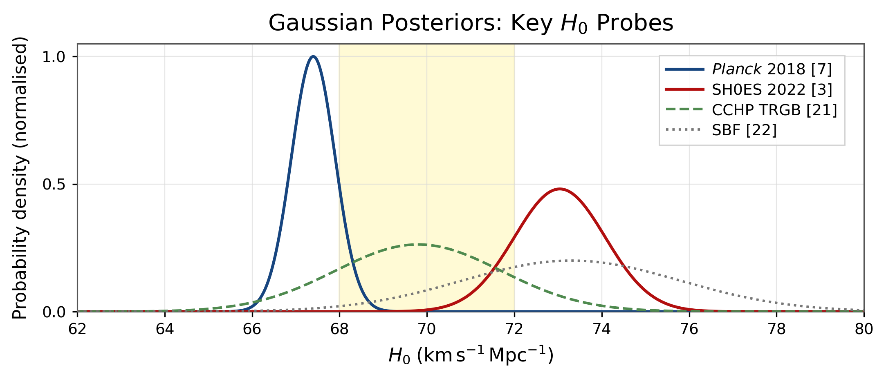

# The Hubble Tension: A Critical Literature Review

A critical literature review examining the Hubble tension, its observational foundations, possible systematic uncertainties, and proposed directions for resolving the discrepancy.

## Overview

The Hubble tension refers to the discrepancy between measurements of the present-day expansion rate of the Universe obtained through different observational approaches.

This review examines the problem from both observational and methodological perspectives, with particular attention to:

- CMB-based measurements
- The local distance ladder
- Cepheid calibration uncertainties
- Independent and non-ladder measurements
- The ladder-vs-non-ladder interpretation
- Proposed theoretical explanations
- Future observational tests

The review critically discusses three central works:

1. Perivolaropoulos (2024)
2. Mörtsell et al. (2022)
3. Riess et al. (2022)

## Reproducibility

This repository contains the data and Python/Jupyter notebooks used to reproduce the figures presented in the literature review.

The workflow is:

**Data → Jupyter Notebook → Figure**

## Repository Structure

```text
Hubble-tension-literature-review/
│
├── data/
│   ├── h0_gaussian_posteriors_fig4_data.csv
│   ├── h0_late_universe_fig3_data.csv
│   ├── h0_representative_measurements_fig1_data.csv
│   └── mortsell_2022_fig2_data.csv
│
├── figures/
│   ├── figure1_representative_H0_measurements.png
│   ├── mortsell_2022_fig2_reproduced.png
│   ├── figure3_late_universe_H0.png
│   └── figure4_gaussian_H0_posteriors.png
│
├── notebooks/
│   ├── 01_representative_h0.ipynb
│   ├── 02_mortsell_calibration.ipynb
│   ├── 03_late_universeh0.ipynb
│   └── 04_h0_posteriors.ipynb
│
├── paper/
│   └── Literature Review ( edited ).pdf
│
├── references/
│   └── references.bib
│
├── .gitignore
└── README.md

```
## Reproduced Figures

### Figure 1 — Representative H₀ Measurements

Comparison of representative measurements of the Hubble constant from different observational approaches.



**Notebook:**  
`notebooks/01_representative_h0.ipynb`

**Data:**  
`data/h0_representative_measurements_fig1_data.csv`

**Figure:**  
`figures/figure1_representative_H0_measurements.png`

### Figure 2 — Cepheid Calibration Variants

H₀ values inferred under different Cepheid colour-luminosity calibration schemes discussed by Mörtsell et al. (2022).



**Notebook:**  
`notebooks/02_mortsell_calibration.ipynb`

**Data:**  
`data/mortsell_2022_fig2_data.csv`

**Figure:**  
`figures/mortsell_2022_fig2_reproduced.png`

### Figure 3 — Late-Universe H₀ Measurements

Comparison of representative late-Universe measurements of the Hubble constant and their uncertainties.



**Notebook:**  
`notebooks/03_late_universeh0.ipynb`

**Data:**  
`data/h0_late_universe_fig3_data.csv`

**Figure:**  
`figures/figure3_late_universe_H0.png`

### Figure 4 — Gaussian H₀ Posteriors

Gaussian approximations to representative H₀ measurements for Planck, SH0ES, CCHP TRGB, and surface brightness fluctuations.



**Notebook:**  
`notebooks/04_h0_posteriors.ipynb`

**Data:**  
`data/h0_gaussian_posteriors_fig4_data.csv`

**Figure:**  
`figures/figure4_gaussian_H0_posteriors.png`

## Paper

The complete literature review is available in:

`paper/Literature Review ( edited ).pdf`

## References

The bibliography used in the literature review is provided in:

`references/references.bib`

The bibliography contains the 41 references cited in the review.

## Software

The figures were produced using Python and Jupyter notebooks.

Main tools used include:

- Python
- Jupyter Notebook
- NumPy
- Pandas
- Matplotlib
- SciPy

## Author

**Anirban Mohonta Ayon**

B.Sc. (Hons.) Physics  
Ramjas College, University of Delhi

## Project Purpose

This repository is intended to make the analysis and figure reproduction associated with the literature review transparent and reproducible.

Each figure is linked to its corresponding dataset and Jupyter notebook, allowing the analysis workflow to be inspected and reproduced.
